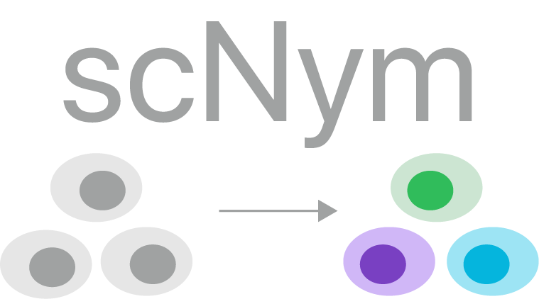
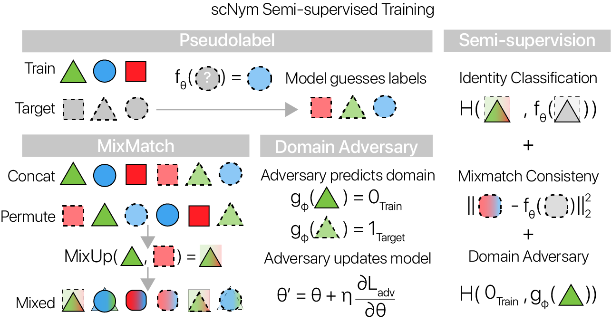

# scNym - Semi-supervised adversarial neural networks for single cell classification

<p align="center">
    
</p>


`scNym` is a neural network model for predicting cell types from single cell profiling data (e.g. scRNA-seq) and deriving cell type representations from these models. 
While cell type classification is the main use case, these models can map single cell profiles to arbitrary output classes (e.g. experimental conditions).

We've described `scNym` in a recent preprint.
Please cite our work if you find this tool helpful.

```
PLACEHOLDER
```

If you have an questions, please feel free to email me.

Jacob C. Kimmel  
[jacobkimmel+scnym@gmail.com](mailto:jacobkimmel+scnym@gmail.com)  
Calico Life Sciences, LLC  

## Model

The `scNym` model is a neural network leveraging modern best practices in architecture design.
Gene expression vectors are transformed by non-linear functions at each layer in the network.
Each of these functions have parameters that are learned from data.

`scNym` uses the MixMatch semi-supervision framework [(Berthelot et. al. 2019)](https://papers.nips.cc/paper/8749-mixmatch-a-holistic-approach-to-semi-supervised-learning) and domain adversarial training to take advantange of both labeled training data and unlabeled target data to learn these parameters.
Given a labeled dataset `X` and an unlabeled dataset `U`, `scNym` uses the model to guess "pseudolabels" for each unlabeled observation.
All observations are then augmented using the "MixUp" weighted averaging method prior to computing losses.

We also introduce a domain adversarial network [(Ganin et. al. 2016)](https://arxiv.org/abs/1505.07818) that predicts the domain of origin (`{target, train}`) for each observation.
We invert the adversaries gradients during backpropogation so the model learns to "compete" with the adversary by adapting across domains.
Model parameters are then trained to minimize a supervised cross-entropy loss applied to the labeled examples, an unsupervised mean squared error loss applied to the unlabeled examples, and a classification loss across domains for the domain adversary.

<p align="center">
    
</p>

## Tutorials

The best way to become acquainted with `scNym` is to walk through one of our interactive tutorials.
We've prepared tutorials using [Google Colab](https://colab.research.google.com/) so that all computation can be performed using free GPUs. 
You can even analyze data on your cell phone!

### (1) Semi-supervised cell type classification using cell atlas references

This tutorial demonstrates how to train a semi-supervised `scNym` model using a pre-prepared cell atlas as a training data set and a new data set as the target.
You can upload your own data through Google Drive to classify cell types in a new experiment.

[**Semi-supervised Training**](https://colab.research.google.com/drive/1tu1O-nGne7Fi9RKh1ERpNBFnF7dzl93_)

<a href="https://colab.research.google.com/drive/1tu1O-nGne7Fi9RKh1ERpNBFnF7dzl93_"></a>

### (2) Classifying cell types with pre-trained scNym models

We also provide a tutorial that uses pre-trained scNym model weights to classify cell types in your data. 
These predictions are less accurate than those provided by semi-supervised training with your data, but they are much faster to generate.

We provide pre-trained weights for mouse, rat, and human cell atlases.

[**Classification with Pre-trained Models**](https://colab.research.google.com/drive/1H3k-QNrqmJyzu8teTiwSSHBTpUwcg7bs)

<a href="https://colab.research.google.com/drive/1H3k-QNrqmJyzu8teTiwSSHBTpUwcg7bs"></a>

## Installation

First, clone the repository:

We recommend creating a virtual environment for use with `scNym`. This is easily accomplished using `virtualenv` or `conda`.

```bash
$ virtualenv scnym_env
$ source scnym_env/bin/activate
```

or 

```bash
$ conda create -n scnym_env
$ conda activate scnym_env
```

Once the environment is set up, simply run:

```bash
$ pip install scnym
```

After installation completes, you should be able to run `scNym` as a command line tool:

```bash
$ scnym --help
```

# Usage

## Data Preprocessing

Data inputs for scNym should be `log(CPM + 1)` normalized counts, where CPM is Counts Per Million and `log` is the natural logarithm.
This transformation is crucial if you would like to use any of our pre-trained model weights, provided in the tutorials above.

Input data can be stored as a dense `[Cells, Genes]` CSV of normalized counts, or in an [AnnData](https://anndata.readthedocs.io/en/stable/) `h5ad` object, or a [Loompy](http://loompy.org/) `loom` object.

## Python API

We recommend users take advantange of our python API for scNym, suitable for use in scripts and Jupyter notebooks.
The API follows the [`scanpy` functional style](https://scanpy.readthedocs.io/en/stable/index.html) and has a single end-point.

To begin with the python API, load your training and test data into `anndata.AnnData` objects using [`scanpy`](https://scanpy.readthedocs.io/en/stable/index.html).

### Training

Training an scNym model using the python API is simple.
We provide an example below.

```python
from scnym.api import scnym_api

scnym_api(
    adata=adata,
    task='train',
    groupby='cell_ontology_class',
    out_path='./scnym_output',
    config='no_new_identity',
)
```

The `groupby` keyword specifies a column in `adata.obs` containing annotations to use for model training.
This API supports semi-supervised adversarial training using a special token in the annotation column.
Any cell with the annotation `"Unlabeled"` will be treated as part of the target dataset and used for semi-supervised and adversarial training.

We also provide two predefined configurations for model training.

1. `no_new_identity` -- This configuration assumes every cell in the target set belongs to one of the classes in the training set. This assumption improves performance, but can lead to erroneously high confidence scores if new cell types are present in the target data.
2. `new_identity_discovery` -- This configuration is useful for experiments where new cell type discoveries may occur. It uses pseudolabel thresholding to avoid the assumption above. If new cell types are present in the target data, they correctly receive low confidence scores. 

### Prediction

```python
from scnym.api import scnym_api

scnym_api(
    adata=adata,
    task='predict',
    key_added='scNym',
    trained_model='./scnym_output',
    out_path='./scnym_output',
    config='no_new_identity',
)
```

The prediction task adds a key to `adata.obs` that contains the scNym annotation predictions, as well as the associated confidence scores.
The key is defined by `key_added` and the confidence scores are stored as `adata.obs[key_added + '_confidence']`.

The prediction task also extracts the activations of the penultimate scNym layer as an embedding and stores the result in `adata.obsm["X_scnym"]`.

## Training and predicting with Cell Atlas References

We also provide a set of preprocessed cell atlas references for [human](https://pubmed.ncbi.nlm.nih.gov/32214235/), [mouse](https://pubmed.ncbi.nlm.nih.gov/30283141), and [rat](https://pubmed.ncbi.nlm.nih.gov/32109414/), as well as pretrained weights for each.

It's easy to use the scNym API to transfer labels from these atlases to your own data.

### Semi-supervised training with cell atlas references

The best way to transfer labels is by training an scNym model using your data as the target dataset for semi-supervised learning.
Below, we demonstrate how to train a model on a cell atlas with your data as the target.

```python
import anndata
from scnym.api import scnym_api, atlas2target

# load your data
adata = anndata.read_h5ad(path_to_your_data)

# first, we create a single object with both the cell
# atlas and your data
# `atlas2target` will take care of passing annotations
joint_adata = atlas2target(
    adata=adata,
    species='mouse',
    key_added='annotations',
)

# now train an scNym model as above
scnym_api(
    adata=joint_adata,
    task='train',
    groupby='annotations',
    out_path='./scnym_output',
    config='new_identity_discovery',
)
```

### Prediction with pre-trained weights

Fully supervised scNym models don't work quite as well, but prediction is very fast.
To predict with pretrained weights, simply run the `scnym_api` prediction, but specify `"pretrained_{species}"` as the `trained_model`.

```python
import anndata
from scnym.api import scnym_api

# load your data
adata = anndata.read_h5ad(path_to_your_data)

# predict using pre-trained weights
scnym_api(
    adata=adata,
    task='predict',
    key_added='scNym',
    trained_model='pretrained_mouse',
    out_path='./scnym_output',
)
```

## CLI

Models can be also trained using the included command line interface, `scnym`.
The CLI allows for more detailed model configuration, but should only be used for experimentation.

The CLI accepts configuration files in YAML or JSON formats, with parameters carrying the same names as command line arguments.

To see a list of command line arguments/configuration parameters, run:

```bash
$ scnym -h
```

A sample configuration is included as `default_config.txt`.

### Demo Script

A CLI demo shell script is provided that downloads data from the [*Tabula Muris*](https://tabula-muris.ds.czbiohub.org/) and trains an `scnym` model.

To execute the script, run:

```bash
chmod +x demo_script.sh
source demo_script.sh
```

in the repository directory.
